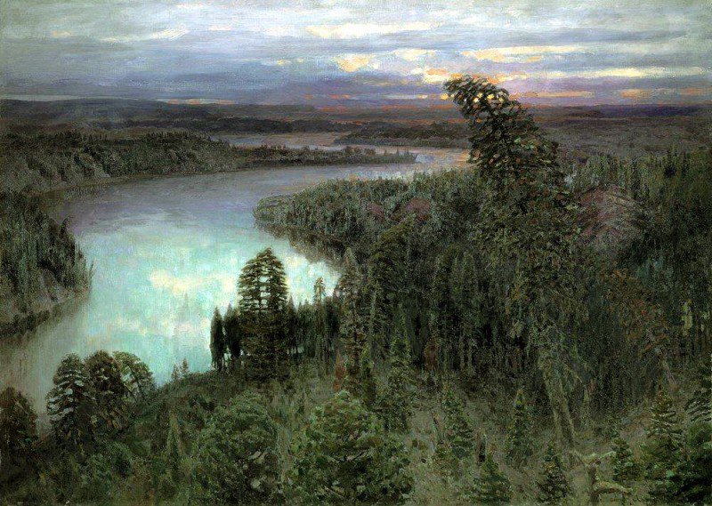

Сотни лет назад за Уральскими горами скрывалась дикая, свободная и неизученная территория. Жажда странствий подталкивала людей переваливать цепочку каменных гор, пересекать Великую Равнину, чтобы затем затеряться в горах Южной Сибири, или спускаться на север, к ледяным морям. Иные стремились на Восток, пока не выходили к Тихому океану.

Они были свободолюбивцами, бунтарями, не умели жить как все. Это были сильные, закалённые и трудолюбивые люди, они заслуженно шли нетронутыми просторами чистых рек. Те мужчины и женщины остались в прошлом, единожды пройдя своим сложным маршрутом, освоив свои земли, они навсегда затерялись в безбрежной тайге.

## The First Settlers Trail map



## Четыре Года

Четыре бесконечных года занимает путь от родного дома до края земли. Четыре года через полную неизвестность, заполненную трудностями пути и радостями открытий.

### 1 год. На Границу Обжитых Земель. Чрез Камень. Погружение в Сибирь.
### 2 год. Сквозь Великую Равнину. Горная Страна.
### 3 год. Порожистые реки Горной страны. Океан.
### 4 год. На Крайний Север. Вдоль Океана.

## В литературе

### «Курс русской истории» Ключевского

Лес и особенно степь действовали на русского человека двусмысленно. Зато никакой двусмысленности, никаких недоразумений не бывало у него с русской рекой. На реке он оживал и жил с ней душа в душу. Он любил свою реку, никакой другой стихии своей страны не говорил в песне таких ласковых слов — и было за что.

При переселениях река указывала ему путь, при поселении она — его неизменная соседка: он жался к ней, на её непоёмном берегу ставил своё жильё, село или деревню. В продолжение значительной постной части года она и кормила его. Для торговца она — готовая летняя и даже зимняя ледяная дорога, не грозила ни бурями, ни подводными камнями: только вовремя поворачивай руль при постоянных капризных извилинах реки да помни мели, перекаты.

Река является даже своего рода воспитательницей чувства порядка и общественного духа в народе. Она и сама любит порядок, закономерность. Её великолепные половодья, совершаясь правильно, в урочное время, не имеют ничего себе подобного в западноевропейской гидрографии. Указывая, где не следует селиться, они превращают на время скромные речки в настоящие сплавные потоки и приносят неисчислимую пользу судоходству, торговле, луговодству, огородничеству. Редкие паводки при малом падении русской реки не могут идти ни в какое сравнение с неожиданными и разрушительными наводнениями западноевропейских горных рек. Русская река приучала своих прибрежных обитателей к общежитию и общительности.

В Древней Руси расселение шло по рекам и жилые места особенно сгущались по берегам бойких судоходных рек, оставляя в междуречьях пустые лесные или болотистые пространства. Если бы можно было взглянуть сверху на среднюю Россию, например, XV века, она представилась бы зрителю сложной канвой с причудливыми узорами из тонких полосок вдоль водных линий и со значительными тёмными промежутками. Река воспитывала дух предприимчивости, привычку к совместному, артельному действию, заставляла размышлять и изловчаться, сближала разбросанные части населения, приучала чувствовать себя членом общества, обращаться с чужими людьми, наблюдать их нравы и интересы, меняться товаром и опытом, знать обхождение. Так разнообразна была историческая служба русской реки.

<small>_Ключевский Василий Осипович «Курс русской истории», Лекция IV. 1904 год._</small>

 <small>_Васнецов Аполлинарий Михайлович «Северный край. Сибирская река». 1899 год._</small>

### «Илимская Пашня»

Не поиски пушнины, не разведки серебряных жил и золотых россыпей, не промысловая, торговая или промышленная колонизация, а сельскохозяйственное освоение Сибири является стержнем её экономического развития. Оно заставило местные народы сложить оружие, воспринять земледельческую культуру русского крестьянства и навсегда сделало сибирские пространства неотъемлемой частью России. Истинными завоевателями Сибири были не казаки и воеводы, а пашенные крестьяне.

Именно крестьяне быстро и навсегда решили вопрос — быть ли Сибири китайской, японской, английской или русской. Внутри дорусской Сибири не было сил, способных объединить её разноплеменное население в самостоятельное целое. Местные народы неизбежно должны были соединить свою судьбу с судьбами большого народа. Таким народом по праву явился русский народ. А так как в те времена подлинной сердцевиной его были крестьяне, то, естественно, что крестьянство оказалось главным фактором превращения Сибири в русский край, а по составу населения — даже более русский, чем были некоторые доуральские и приволжские области.

<small>_Шерстобоев Вадим Николаевич «Илимская Пашня». 1949 год._</small>

### «Течение на Запад»

Неотёсанный Арон Старк, он обладал всеми качествами настоящего пионера: храбростью, упрямством и железной волей, не знающей преград. В последующие годы в более цивилизованном, приручённом мире этот тип пионеров не понадобится, они станут всеми преданными и презираемыми бродягами, скитающимися в поисках неизведанного, которое таится где-то там, за горизонтом. Презираемые более приспособленными и благоденствующими, они даже получат прозвище «бродяги». То, что пионеры должны быть слеплены именно из такого теста, будет забыто.

В период расширения территории страны из этих людей в основном и состояли караваны фургонов. Они не толклись у фортов и поэтому часто гибли в схватках с индейцами, их жены вскармливали младенцев с винчестерами на коленях, а сами они пахали, повесив оружие на ручки плугов. Они не страшились ни индейцев, ни крупных скотоводов, ни бандитов. Они были первопоселенцами, скваттерами, покорителями Запада. Это были люди, которые шли на риск, которые умирали за свою землю, но они редко умирали в одиночестве и не всегда — напрасно.

Источник этих людей не иссякал никогда. На любой границе можно было встретить людей типа Арона Старка, сильных, немногословных, неграмотных, одержимых желанием иметь дом и землю. Многие шли за наживой, но Старки грабить не собирались, они брали с собой семьи и шли строить и жить.

<small>_Луис Ламур «Течение на Запад». 1951 год._</small>

## Another Resources

### Meeting of Frontiers

Проект, содержащий изображения и текстовую информацию из редких книг, рукописей, фотоколлекций, карт и фильмов, принадлежащих библиотеке Конгресса США, музеям США и России:
[Meeting of Frontiers, frontiers.loc.gov](http://frontiers.loc.gov/intldl/mtfhtml/mfsplash.html?target=_blank).